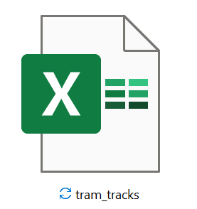
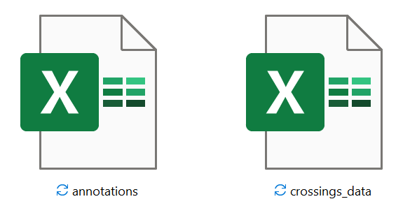

## **1) SafeCross AUTO**

    

    

    

    

    <table>
        <tr>
            <td></td>
            <td></td> 
        </tr>
        <tr>
            <!-- Add your headings here -->
            <th>Output all data in .xlsx files</th>
            <th>Automatically convert to world coordinates, and process to calculate crossing angles</th>
        </tr>
    </table>

_short term:_
1. incorporate YOLOv5xDCC and SORT ✔
2. add option for user to specify confidence level threshold ✔
3. use projection to estimate point to use within bounding box
5. plot coordinate system
6. read in tram track annotations ✔
7. plot world coordinate system and tram tracks on the images ✔
8. incorporate risk models for plotting heat map

_Long term:_
1. Try retraining YOLOv8, with discussed enhancements for bicycle/rider tracking

