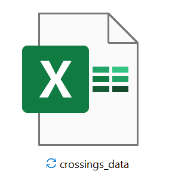

## **SafeCross SMoS**

    

    

    

    

<table>
<tr>
    <td></td>
    <td></td>
</tr>
</table>

,})

},\dots,\frac{Gap}{\sin(\theta_M)}\right]\text{%20for%20model%20(c).})

### Downloads
The standalone application can be downloaded from this Google Drive [link](https://drive.google.com/file/d/1ABynPvPQmtPVHS3FKaWbubzpv3U1sL3p/view?usp=sharing).

### To-do

_Short term:_ 
1. read in crossing angles from an excel file with a column marked 'Angle' ✔
2. calculate and plots using model b and/or c  ✔
3. calculate and output N_UC for a user provided count of cyclists ✔
4. make How-to video demonstrating functionality and features

_Long term:_
1. automatically count cyclists for N_UC calculation (in conjunction with SafeCross TA or similar)
2. plot a heat map of riskiest areas (in conjunction with SafeCross TA or similar)
3. output image of heatmap (in conjunction with SafeCross TA or similar)
