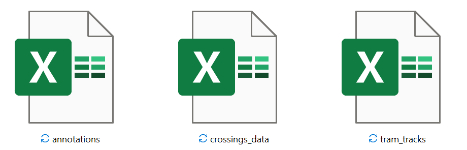
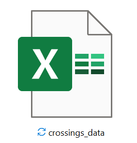

## Associated Publication

This repository is associated with the following paper:

**BibTeX Citation:**
```bibtex
@article{Gildea2023,
   author = {Kevin Gildea and Daniel Hall and Clara Mercadal-Baudart and Brian Caulfield and Ciaran Simms},
   journal = {Journal of Safety Research},
   title = {Computer vision-based assessment of cyclist-tram track interactions for predictive modelling of crossing success},
   volume = {In-Press},
   year = {2023},
}


## **1) SafeCross TA**
[View Details](./trajectory%20annotation)

<div align="center">
    
</div>

<div align="center">
    
</div>


<div align="center">
    <table>
        <tr>
            <td></td>
            <td></td>
        </tr>
        <tr>
            <!-- Add your headings here -->
            <th>Output all data in .xlsx files</th>
            <th>Automatically convert to world coordinates, and process to calculate crossing angles</th>
        </tr>
    </table>
</div>


## **2) SafeCross SMoS**
[View Details](./SMoS)


<div align="center">
    
</div>


<div align="center">
    
</div>


<div align="center">
    
</div>


<div align="center">
    
</div>


<div align="center">
<table>
<tr>
    <td></td>
    <td></td>
</tr>
</table>
</div>
